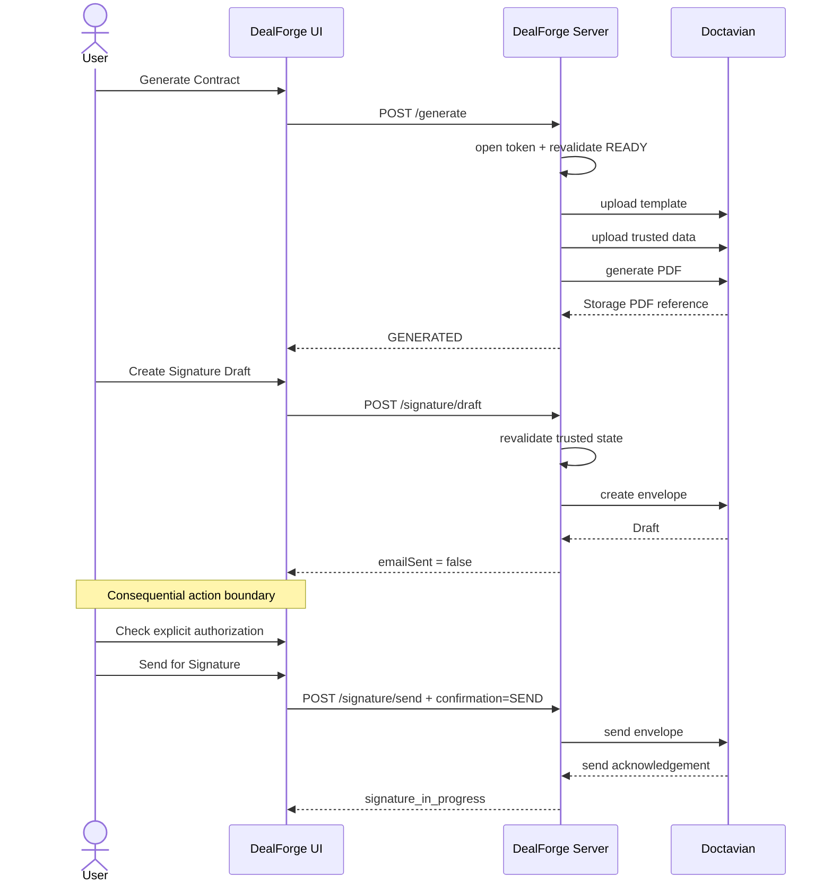

# DeepWiki Q&A with Code Context for Repository: chizzydev/dealforge
## Q1
how can Pithom Labs Solvent take advantage of the insights below with respect to workflow and architecture of dealforge? # Competitive Analysis: Solvent vs AegisFlow **Date:** 2026-09-04 **Purpose:** Identify gaps and limitations of Solvent relative to AegisFlow to determine what Solvent needs to become a competitive, market-ready product. --- ## Executive Summary **Solvent** is a transactional belief ledger for autonomous agents, built on CockroachDB with database-enforced invariants, formal verification in Lean 4, and an MCP server with 16 tools. Its core thesis is "retrieval is not authority" — the database, not the LLM, determines whether an action is allowed. **AegisFlow** is a full-stack TypeScript/Next.js application for AI-powered incident response in critical procurement. It features a rich UI, 7 sponsor API integrations, a workflow state machine with human-in-the-loop guards, a risk scoring engine, document generation, and e-signature capabilities. **Bottom line:** Solvent is a stronger *kernel* but a weaker *product*. AegisFlow demonstrates what the market actually needs: an end-to-end workflow with UI, integrations, human approval gates, and document automation. Solvent's database-enforced invariants are technically superior, but they remain invisible to the user without the surrounding product layer. --- ## 1. Architecture Comparison | Dimension | Solvent | AegisFlow | |---|---|---| | **Language** | Go 1.25 | TypeScript 5 (strict) | | **Framework** | Standard library HTTP + MCP SDK | Next.js 16 (App Router, Turbopack) | | **Database** | CockroachDB Cloud Serverless (v26.2.5) | Xano (free-tier) + in-memory fallback | | **UI** | 3-screen embedded demo wizard | Full dashboard with 8+ pages | | **Deployment** | AWS App Runner | Vercel | | **Vector Search** | CockroachDB native VECTOR(1024) | None (web search via SerpApi) | | **Formal Verification** | Lean 4 + Mathlib (zero sorry) | None | | **Agent Integration** | MCP server (16 tools, stdio) | None (Next.js server actions) | **Gap:** Solvent has no modern web UI. AegisFlow's dashboard includes incident overview, audit trail, evidence panels, supplier comparison, document viewer, integration status, and approval queue — all things a non-technical user expects. --- ## 2. Feature-by-Feature Gap Analysis ### 2.1 Workflow State Machine **AegisFlow:** 8-state FSM (`INVESTIGATING → RECOMMENDATION_READY → HUMAN_REVIEW → APPROVED → DOCUMENT_PREPARED → SIGNATURE_REQUIRED → SIGNED / REJECTED`). Transitions validated in code. Three states are `HUMAN_ONLY` — the AI orchestrator cannot cross them. `requiresHuman()` and `assertHumanMaySign()` enforce this structurally. **Solvent:** Belief lifecycle has 3 states (`entered → promoted → retracted`). `action_intent` has 3 states (`live → cancelled → executed`). No explicit workflow FSM — the "workflow" is the promotion gate (debt must be empty) and intent gate (belief must be promoted). **Gap:** Solvent has no concept of a *workflow* with ordered stages and human approval gates. The belief lifecycle is a state machine, but it is not exposed as a configurable workflow. A customer cannot define "Stage 1: AI investigates, Stage 2: Human reviews, Stage 3: Human approves" without building that logic themselves. **Market need:** Enterprises need configurable approval workflows where AI does the work and humans sign off. Solvent's kernel *enforces* that a belief must be debt-free before promotion, but it does not provide the UI or workflow layer to make that enforcement usable. ### 2.2 Human-in-the-Loop Authorization **AegisFlow:** - `HUMAN_ONLY_TARGETS = ["APPROVED", "REJECTED", "SIGNED"]` — enforced in `machine.ts` - `assertHumanMaySign(actor, state)` — throws `AgentAuthorizationError` if actor is not HUMAN - `AGENT_TOOLS` registry classifies tools by risk (`REVERSIBLE` / `IRREVERSIBLE`) and maps each to allowed actors and required states - `assertToolAllowed(toolId, actor, state)` — blocks AI from reaching irreversible operations - Guards are called on the *path to the operation*, not as convention **Solvent:** - `action_intent` composite FK gate: `belief_status` must be `'promoted'` for `state = 'live'` - `RetractCascade` cancels live intents before retracting (order enforced by schema) - Authority lifecycle: `Approve` is the sole authority-creating operation, requires hash pin verification - `Authorize` is read-only verification against snapshot - `RevokeTarget` is append-only **Gap:** Solvent's authority model is cryptographically stronger (hash pins, snapshot immutability), but it lacks *actor classification*. There is no concept of "this operation is AI-only, this one requires a human." The MCP server exposes 16 tools but does not classify them by risk or restrict them by actor type. **Market need:** Customers need to know *who* (human vs AI) can perform *which* actions, and the system must enforce it. Solvent enforces that a belief must be promoted before an intent can cite it, but it does not enforce that a human must approve the promotion. ### 2.3 Risk Scoring and Decision Support **AegisFlow:** - 6-dimension risk engine: compliance (25), delivery (20), evidence (20), reliability (15), cost (10), compatibility (10) - Each dimension scores 0-100 with cited reasons from evidence - `INTEGRITY_CAP = 49` — supplier with unresolved CONFLICT capped at 49/100 regardless of weighting - `evaluateSupplier()` and `evaluateAll()` produce ranked recommendations - Transparent scoring: every dimension shows its evidence sources **Solvent:** - Beliefs have a `debt` array (6 items at entry) - Debt items are retired one at a time via `RetireDebt` - Promotion requires empty debt - No scoring, no ranking, no multi-dimensional assessment - Contradictions exist in `belief_edge` but do not affect a score **Gap:** Solvent tracks *whether* a belief is ready for promotion, but it does not quantify *how ready* it is or *how risky* it is. There is no way to compare two beliefs by confidence, evidence quality, or risk. **Market need:** Decision support requires scoring, ranking, and transparent reasoning. Solvent provides the atomic guarantee (no promotion with open debt), but customers need a risk engine on top of that guarantee. ### 2.4 External API Integrations **AegisFlow:** 7 sponsor integrations, each with live/fallback paths, recorded in an Activity Ledger: - **SerpApi** — web intelligence (5 concurrent queries) - **Nutrient DWS** — PDF extraction + watermarking - **Doctavian** — document generation from templates - **Foxit eSign** — electronic signature - **name.com** — domain availability check - **Gemini** — LLM for analysis and decision narratives - **Xano** — persistent storage with rate-limit-aware fallback Every API call logged with `LIVE`/`LOCAL`/`DEMO SEEDED` tags, real request/response, timing, and status. **Solvent:** 1 integration — Amazon Bedrock (Titan v2 embeddings). MCP server is a *tool surface*, not an integration layer. No Activity Ledger equivalent. **Gap:** Solvent has no integration ecosystem. It cannot call external APIs, generate documents, send signatures, or interact with third-party services. **Market need:** Real-world workflows require integration with document management, e-signature, CRM, ERP, and communication systems. Solvent's kernel is strong but isolated. ### 2.5 Document Generation and E-Signature **AegisFlow:** - Generates Emergency Supplier Transition Agreement via Doctavian - Zod-validated contract payload with structured fields - Watermarks PDF with "PENDING HUMAN SIGNATURE" via Nutrient - Creates Foxit eSign folder with `sendNow: false` - Entire flow guarded: only HUMAN actor from `SIGNATURE_REQUIRED` state can trigger signing **Solvent:** No document generation. No e-signature. No contract payload. **Gap:** This is the most visible gap for enterprise customers. Solvent can *decide* that a belief is authoritative and an action is permitted, but it cannot *produce the document* that records that decision or *route it for signature*. **Market need:** Decisions need to become documents. Documents need signatures. Solvent's authority model is strong, but without document generation, the "action" that follows an authorized intent must be implemented by the customer. ### 2.6 User Interface **AegisFlow:** Full React dashboard with: - Incident overview cards, main incident console - Audit trail (append-only event history) - Evidence panel with external sources - Supplier comparison and ranking - Document viewer, integration activity ledger - Approval queue, risk model with live re-weighting - Demo controls with failure injection **Solvent:** 3-screen embedded wizard: 1. ASK — search etcd issues, select evidence, attempt promotion 2. DISCHARGE — record review obligations, retry promotion 3. FALSIFY — introduce falsifier, observe cascade **Gap:** Solvent's wizard is a *demo* — it proves the thesis but does not serve as a product UI. No dashboard, no audit trail view, no evidence browser, no approval queue, no settings page. **Market need:** Non-technical users need a visual interface to review beliefs, approve actions, trace evidence, and manage the lifecycle. Solvent's MCP server serves *agents*, but agents are not the only consumers. ### 2.7 Demo Controls and Failure Injection **AegisFlow:** - Per-sponsor failure injection toggles - One-click `Reset demo` button - `DEMO SEEDED` mode for offline operation - Every integration degrades gracefully with honest fallback **Solvent:** - Named scenarios (`SOLVENT_SCENARIO_1`, `SOLVENT_SCENARIO_2`) - Single demo dataset (etcd issues) - Deploy-time assertion of measured values - No failure injection, no graceful degradation controls **Gap:** Solvent's demo is tightly coupled to one scenario. There is no way to inject failures, toggle modes, or reset state from the UI. **Market need:** Sales engineers need controllable demos that show both happy and failure paths. AegisFlow's demo controls make this trivial; Solvent's do not. ### 2.8 Evidence Status Tracking **AegisFlow:** 5 evidence statuses: `VERIFIED`, `UNVERIFIED`, `CONFLICT`, `STALE`, `MISSING`. Each claim carries status, confidence score, conflict reason, and optional document evidence with verification rule name. Rules are *computed*, not scripted. **Solvent:** Beliefs have status (`entered`/`promoted`/`retracted`). Evidence recorded with `provenance_class` and `content_sha256`. No concept of "conflicting" or "unverified" per claim. Contradictions exist in `belief_edge` but do not affect claim status. **Gap:** Solvent tracks evidence *existence* but not evidence *quality*. A customer cannot see "3 of 5 claims are verified, 1 is conflicting, 1 is unverified." **Market need:** Users need to understand the strength of evidence behind a belief. Solvent's debt mechanism partially addresses this, but it does not provide per-claim confidence or conflict tracking. --- ## 3. Where Solvent Is Stronger ### 3.1 Database-Enforced Invariants Solvent's schema-level invariants (`promoted_is_debt_free`, `gate`, `live_requires_promoted`) are enforced by CockroachDB CHECK constraints and composite foreign keys. AegisFlow's guards are application-level — a code change could bypass them. In regulated industries (finance, healthcare, defense), this is a critical differentiator. ### 3.2 Formal Verification Solvent's Lean 4 model proves 8 state-machine properties with zero `sorry` or `admit`. AegisFlow has none. Mathematical certainty is a differentiator for customers who need provable correctness. ### 3.3 MCP Server Solvent's 16-tool MCP server exposes the ledger to any MCP-compatible agent. AegisFlow has no agent integration surface. As MCP adoption grows, Solvent is positioned as a backend that any agent can query. ### 3.4 Transactional Authority Model Solvent's authority lifecycle (propose → justify → pin → approve → authorize → revoke) with hash-pin verification and snapshot immutability is cryptographically stronger than AegisFlow's application-level guards. ### 3.5 Vector Search with Real Embeddings 7,239 real etcd issues with genuine Titan v2 embeddings, served by CockroachDB's native vector index. AegisFlow uses web search with no local vector store. --- ## 4. Market Gaps Solvent Must Close ### Priority 1: Web UI (Critical) Solvent needs a production dashboard: belief browser with status/debt/evidence/relationships, approval queue, audit trail with filtering, evidence viewer with provenance, scenario management, integration status. ### Priority 2: Configurable Workflow Engine (Critical) Workflow layer on top of belief lifecycle: configurable stages, per-stage actor restrictions, per-stage tool restrictions, transition guards referencing evidence status. ### Priority 3: Risk Scoring Engine (High) Multi-dimensional scoring with configurable weights, per-dimension evidence citation, integrity caps for conflicts, ranked recommendations, transparent reasoning. ### Priority 4: External API Integration Layer (High) Pluggable adapter pattern, Activity Ledger recording every outbound call, live/fallback routing per integration, demo-seeded mode. ### Priority 5: Document Generation (Medium) Template-based document generation, payload validation, PDF watermarking, e-signature integration. ### Priority 6: Multi-Scenario Support (Medium) Scenario creation/management UI, configurable evidence sources, per-scenario vector indexes, scenario comparison. ### Priority 7: Demo Controls (Low) Failure injection toggles, one-click reset, pre-seeded scenarios, narrative walkthrough. --- ## 5. Recommended Strategy Solvent should not become AegisFlow. The kernel is the differentiator. The strategy is to **add the product layer that makes the kernel visible and usable**, while preserving the architectural guarantees. - **Phase 1:** Make the kernel visible — web UI, scenario management, integration dashboard - **Phase 2:** Make the kernel actionable — workflow engine, risk scoring, actor/tool restrictions - **Phase 3:** Make the kernel productive — external integrations, document generation, e-signature - **Phase 4:** Make the kernel demonstrable — demo controls, failure injection, narrative walkthrough --- ## 6. Conclusion Solvent has the stronger foundation. Database-enforced invariants, formal verification, and transactional authority model are technically superior. But foundation is not product. The market does not buy invariants — it buys **workflows that are provably correct**. Solvent needs to wrap its kernel in the UI, workflow, and integration layers that make those invariants visible to the humans who depend on them. The gap is not technical depth — it is product breadth.
### Answer
DealForge is a live, working example of exactly the "product layer" that the competitive analysis says Solvent lacks — it's worth treating as a reference architecture rather than a hypothetical, since it already solves several of the "Priority 1/2/5" gaps in a way that's compatible with a kernel-first philosophy like Solvent's.

## 1. Workflow engine (Priority 2 gap)

DealForge implements exactly the "configurable stages with human gates" that the analysis says Solvent is missing. It has an explicit `DealWorkflowStage` linear state machine (`ready → generated → signature_draft → signature_in_progress → completed`), where each transition is handled by a dedicated "advance" function that enforces invariants dealforge:161-162 . Rather than leaving "workflow" implicit in the belief lifecycle (as Solvent does), Solvent could wrap its `entered → promoted → retracted` / `live → cancelled → executed` states in an explicit stage machine analogous to DealForge's, with named stages exposed via API and UI rather than only as internal FK/CHECK constraints.

Crucially, DealForge's workflow state isn't stored in a database at all — it's carried statelessly as an **HMAC-sealed workflow token** (`sealDealWorkflowState` / `openDealWorkflowToken`, HMAC-SHA256, `timingSafeEqual` verification, 32-char minimum secret) dealforge:171-186 . Every mutation re-opens the token and **re-validates the DealManifest against current Trust Kernel rules** before proceeding dealforge:189-198 . This is a pattern Solvent could reuse to expose its CockroachDB-enforced invariants through a stateless, tamper-evident token that agents/UIs pass around — giving the "workflow visibility" the analysis calls for without weakening the DB-level guarantees.

## 2. Human-in-the-loop gating (Priority 2)

DealForge draws a hard "Human Authorization Boundary" between `signature_draft` and `signature_in_progress`: creating an envelope (`createGeneratedDealEnvelope`) sets `emailSent: false`, and only an explicit `POST /api/deals/signature/send` — requiring a `SEND` confirmation string plus valid workflow state — actually triggers dispatch dealforge:121-154 . This is reinforced by an operational safety flag pair (`DEALFORGE_SIGNATURE_SEND=true` and `DEALFORGE_SIGNATURE_SEND_CONFIRM=SEND`) that must both be set for live sends dealforge:30-37 . This is a much more concrete version of AegisFlow's `HUMAN_ONLY_TARGETS`/`assertHumanMaySign` pattern than Solvent currently has. Solvent's MCP tool registry could adopt the same idea: classify each of the 16 tools by "draft vs. send" semantics, and require an explicit human-confirmation string/flag before any tool crosses from a reversible to an irreversible action (e.g., before `Approve` or `RevokeTarget` actually take effect).

## 3. Document generation & e-signature (Priority 5)

DealForge's Doctavian integration is a full worked example of what the analysis flags as Solvent's "most visible gap." It separates **generation** (`generateReadyDealWithDoctavian`, which uploads a `.docx` template + JSON data and triggers PDF rendering) from **signature lifecycle** (`createGeneratedDealEnvelope` / `sendGeneratedDealEnvelope`), with an `assertGenerationReadyConsistency` check that verifies BigInt-computed totals match the manifest before any document is produced dealforge:107-120 . The `DoctavianClient` implements distinct `DoctavianGenerationPort` and `DoctavianSignaturePort` interfaces with Zod-validated responses dealforge:275-279 . Solvent could adopt this adapter-boundary pattern directly for its own Priority 4/5 gaps: treat any future document-generation or e-signature integration as a port/adapter pair sitting *outside* the trust kernel, so external services never gain authority over what CockroachDB has already certified — mirroring DealForge's "Doctavian reports status, but never decides commercial truth" rule dealforge:143-143 .

## 4. The Trust Kernel / Authority Map (Priority 2, general product framing)

DealForge's four-layer "Authority Map" (Interpretation → Authority/Domain → Human Judgment → External Execution) with an explicit table of allowed/prohibited actions per actor dealforge:137-144  is essentially the "actor classification" the analysis says Solvent's MCP server lacks. Solvent's kernel already enforces analogous rules at the database level (e.g., `promoted_is_debt_free`, `live_requires_promoted`), but it doesn't publish an authority map that says "AI may propose/justify, human must approve/authorize." Presenting Solvent's existing invariants through a DealForge-style authority table would make the kernel's guarantees legible to non-technical stakeholders without any schema changes — directly addressing the analysis's core conclusion that "the gap is not technical depth, it is product breadth."

## Summary of transferable patterns

| Solvent gap (from analysis) | DealForge pattern to borrow |
|---|---|
| No configurable workflow with stages | `DealWorkflowStage` linear FSM + per-transition "advance" functions dealforge:79-154  |
| No stateless way to expose kernel state to UI/agents | HMAC-sealed workflow token with re-validation on every mutation dealforge:171-202  |
| No actor/tool restriction (human vs AI) | Draft/Send boundary + `SEND` confirmation + env safety flags dealforge:121-154  |
| No document generation / e-signature | Doctavian generation + signature ports, kept outside the trust kernel dealforge:1-120  |
| No published authority map | README-level Authority Map table dealforge:137-144  |

None of this requires weakening Solvent's CockroachDB-enforced invariants or Lean 4 proofs — DealForge's own design principle is that the trust kernel stays deterministic and database/schema-backed while the workflow/token/integration layers around it are what make that kernel "visible and usable," which is precisely the strategy the competitive analysis recommends for Solvent (Phase 1–3: visible → actionable → productive).

### Citations
**File:** src/application/deal-workflow.ts (L79-154)
```typescript
const readyWorkflowStateSchema =
  z.strictObject({
    ...workflowBaseShape,

    stage:
      z.literal("ready"),
  });

const generatedWorkflowStateSchema =
  z.strictObject({
    ...workflowBaseShape,

    stage:
      z.literal("generated"),

    document:
      generatedDocumentSchema,
  });

const signatureDraftWorkflowStateSchema =
  z.strictObject({
    ...workflowBaseShape,

    stage:
      z.literal(
        "signature_draft",
      ),

    document:
      generatedDocumentSchema,

    envelope:
      envelopeReferenceSchema,
  });

const signatureInProgressWorkflowStateSchema =
  z.strictObject({
    ...workflowBaseShape,

    stage:
      z.literal(
        "signature_in_progress",
      ),

    document:
      generatedDocumentSchema,

    envelope:
      envelopeReferenceSchema,
  });

const completedWorkflowStateSchema =
  z.strictObject({
    ...workflowBaseShape,

    stage:
      z.literal("completed"),

    document:
      generatedDocumentSchema,

    envelope:
      envelopeReferenceSchema,
  });

const dealWorkflowStateSchema =
  z.discriminatedUnion(
    "stage",
    [
      readyWorkflowStateSchema,
      generatedWorkflowStateSchema,
      signatureDraftWorkflowStateSchema,
      signatureInProgressWorkflowStateSchema,
      completedWorkflowStateSchema,
    ],
  );
```
**File:** src/application/deal-workflow.ts (L161-162)
```typescript
export type DealWorkflowStage =
  DealWorkflowState["stage"];
```
**File:** src/application/deal-workflow.ts (L171-202)
```typescript
function requireSigningSecret(
  secret: string,
): string {
  const normalized =
    secret.trim();

  if (
    normalized.length < 32
  ) {
    throw new Error(
      "DealForge workflow signing secret must contain at least 32 characters.",
    );
  }

  return normalized;
}

function assertWorkflowIdentity(
  state: {
    dealId: string;
    manifest: DealManifest;
  },
): void {
  if (
    state.dealId !==
    state.manifest.dealId
  ) {
    throw new Error(
      "DealForge workflow deal identity does not match the trusted manifest.",
    );
  }
}
```
**File:** docs/architecture.md (L121-154)
```markdown
## 4. Generate is not send


```
**File:** docs/architecture.md (L189-198)
```markdown
## 6. Workflow continuity

The workflow token is intentionally not a bag of browser-controlled business state.

It carries trusted server-approved workflow continuity and is HMAC sealed.

Before consequential provider mutations, DealForge reconstructs the generation-ready deal through the trusted preparation boundary and re-runs current readiness.

This prevents a stale or manipulated browser object from becoming execution authority.

```
**File:** .env.example (L30-37)
```text
# Safety boundary.
#
# false = generate + create Draft + retrieve, but send no email.
# To send, BOTH values must deliberately be changed:
# DEALFORGE_SIGNATURE_SEND=true
# DEALFORGE_SIGNATURE_SEND_CONFIRM=SEND
DEALFORGE_SIGNATURE_SEND=false
DEALFORGE_SIGNATURE_SEND_CONFIRM=
```
**File:** src/doctavian/doctavian-generation.ts (L1-120)
```typescript
export interface GenerationReadyDeal {
  manifest: {
    schemaVersion: string;
    dealId: string;

    customer: {
      legalName: string;
      countryCode: string;
      locale: string;
      timezone: string;
    };

    signer: {
      name: string;
      email: string;
    };

    commercialTerms: {
      currency: string;
      billingCycle:
        | "monthly"
        | "quarterly"
        | "annual"
        | "one-time";
      paymentTermsDays: number;
      discountBps: number;
      effectiveDate: string;
      termMonths: number;
      autoRenew: boolean;
    };

    lineItems: readonly {
      code: string;
      name: string;
      quantity: number;
      unitPriceMinor: number;
      priceCadence:
        | "one-time"
        | "monthly"
        | "quarterly"
        | "annual";
    }[];

    requirements: {
      dataProcessing: boolean;
      premiumSupport: boolean;
    };
  };

  totals: {
    currency: string;

    lineTotals: readonly {
      code: string;
      amountMinor: number;
    }[];

    subtotalMinor: number;
    discountBps: number;
    discountMinor: number;
    totalMinor: number;
  };
}

export interface DoctavianUploadedFile {
  id: string;
  fileName: string;
}

export interface DoctavianGeneratedDocument {
  urn: string;
  name: string;
  fileFormat: string;
  deliveryMethod: string;
  operationId?: string;
}

export interface DoctavianGenerateRequest {
  externalContext: {
    id: string;
  };

  template: {
    name: string;
    urn: string;
    fileFormat: "docx";
    loadMethod: "Storage";
    options: Record<string, never>;
  };

  data: {
    loadMethod: "Storage";
    urn: string;
  };

  document: {
    timezone: string;
    locale: string;
    name: string;
    fileFormat: "pdf";
    deliveryMethod: "Storage";
    path: "root";
    options: Record<string, never>;
  };
}

export interface DoctavianGenerationPort {
  uploadTemplate(input: {
    fileName: string;
    bytes: Uint8Array;
  }): Promise<DoctavianUploadedFile>;

  uploadData(
    data: unknown,
  ): Promise<DoctavianUploadedFile>;

  generateDocument(
    request: DoctavianGenerateRequest,
  ): Promise<DoctavianGeneratedDocument>;
}
```
**File:** src/doctavian/doctavian-client.ts (L275-279)
```typescript
export class DoctavianClient
  implements
    DoctavianGenerationPort,
    DoctavianSignaturePort
{
```
**File:** README.md (L137-144)
```markdown
| Actor / layer | What it may do | What it may not do |
| --- | --- | --- |
| **AI extraction** | Extract candidate facts, attach confidence, cite supplied source IDs, surface ambiguity | Invent provenance, own internal product codes, calculate authoritative totals, approve generation |
| **DealForge catalog** | Resolve known product names to app-owned internal codes | Accept model-invented product authority |
| **DealForge domain** | Validate the canonical manifest, evaluate readiness, calculate money, decide `canGenerate` | Delegate final commercial authority to the model |
| **Human** | Explicitly authorize the consequential signature-send action | Bypass the trusted workflow state |
| **Doctavian** | Generate the PDF, create the envelope, send signature requests, report external signing state, return the signed document | Decide DealForge commercial truth |
| **Browser** | Present evidence and invoke explicit application boundaries | Receive provider credentials or promote a blocked/review deal into `READY` |
```
